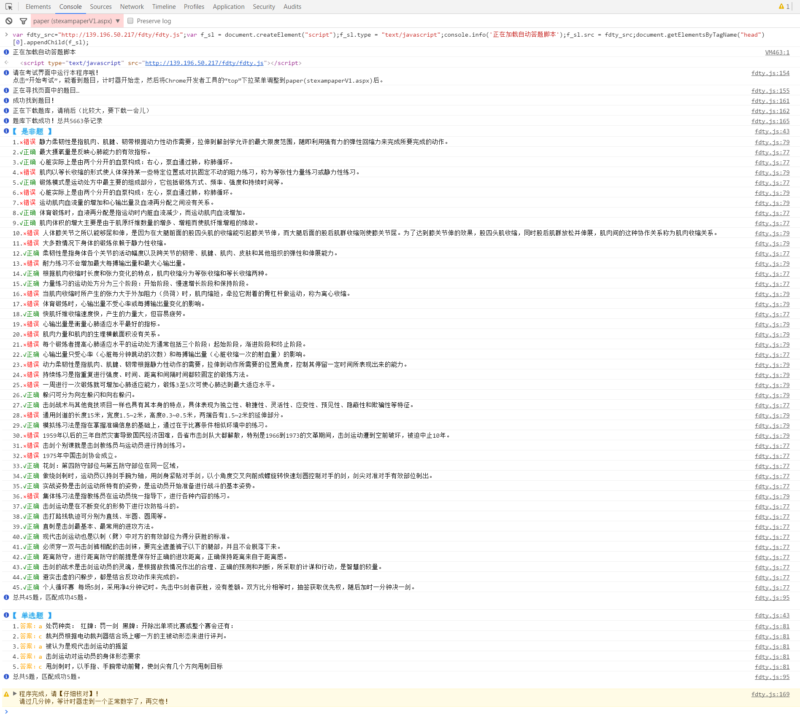
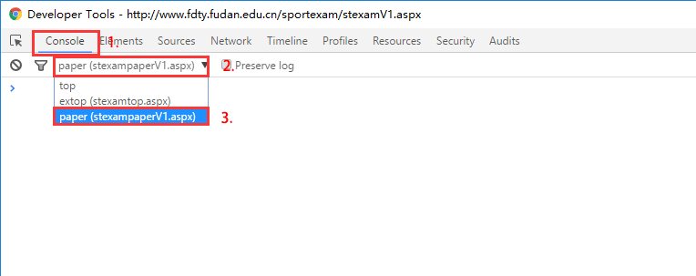
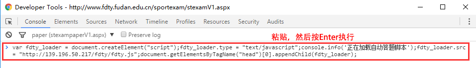
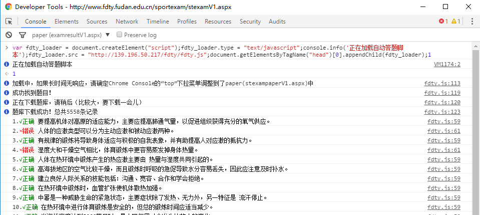

# 复旦体育考试-自动答题机器
* 方便易用，基于Chrome，兼容所有操作系统。
* 自动读取网页、匹配题库，瞬间出答案，节省时间。
* 截止到2016年5月26日，总共有5558道不重复的题

##一张图体会一下

##使用方法

###1. 使用 **Chrome** 打开考试界面
一定要较新版本的Chrome！别的浏览器没试过，尽量不要用！
###2. 在考试界面中，打开开发者工具里的控制台
| 操作系统 | 快捷键 |
| ----- | ----- |
| Windows | <kbd>Ctrl</kbd>+<kbd>Shift</kbd>+<kbd>J</kbd> |
| Mac | <kbd>Command</kbd>+<kbd>Option</kbd>+<kbd>J</kbd> |
###3. 修改左上角下拉菜单的值


调整为 ```paper(stexampaperV1.aspx)```
###4. 复制以下代码，粘贴、运行
	var fdty_loader = document.createElement("script");fdty_loader.type = "text/javascript";console.info('正在加载自动答题脚本');fdty_loader.src = "http://139.196.50.217/fdty/fdty.js";document.getElementsByTagName("head")[0].appendChild(fdty_loader);



###5. 按照自动匹配的结果，打钩、交卷！


###关于刷新/关闭页面重开
体育理论考的界面是可以刷新的，在提交之前，也可以关闭然后重新开，不会消耗提交的次数（2016年5月26日 亲测）
体育理论考界面有代码防止学生刷新，所以按<kbd>F5</kbd>是没用的。但这个很容易绕过，在Chrome开发者工具中，按<kbd>Ctrl</kbd>+<kbd>R</kbd>刷新就行。
所以，如果哪次打开，发现有好几题没有匹配成功的，不妨刷新了重新匹配试试。刷新后，要回到第三步，重新做哦。

##求Pull Request
###1. 完善题库
在```database_generator```目录下有个nodeJs的题目格式转换器，在```rawdata```文件夹中，新建一个txt，以这种方式一行一题，

	["获得和利用食物的综合过程称为营养。","true"],
	["合理的营养意味着机体能够摄入保持身体健康所必须的部分营养成分。","false"],
	...

然后运行```node generate.js```就行了，谢谢。
###2. 自动勾选功能
我之前想做一个自动勾选的功能（更加节省时间，都不要用户点击鼠标了）。
但很悲剧的是，我用

	window.jQuery("#" + getRadioButtonId(questionI, answer)).prop("checked", true);

看似都选上了，一提交，竟然零分。
好像有一个EVENT VALIDATOR，具体零分的原因是不是和这个有关？当时我没仔细看代码，现在系统又不让进了。
要等到下次体育理论考再研究了。
如果有同学发现不会导致0分的自动点击方法，欢迎发PULL REQUEST。
或许用 [这里的模拟用户点击的方法会有用](http://stackoverflow.com/questions/6157929/how-to-simulate-a-mouse-click-using-javascript)
每个人有两次提交机会，如果你有兴趣，请拿你的第一次提交机会做个试验。
